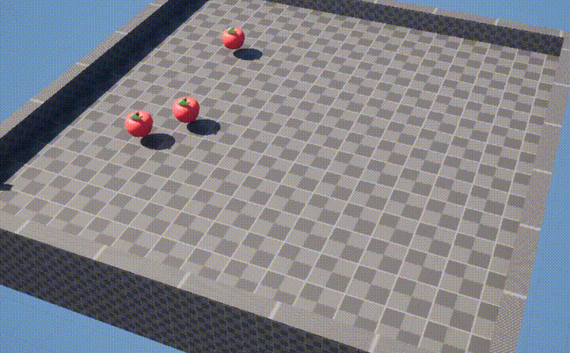
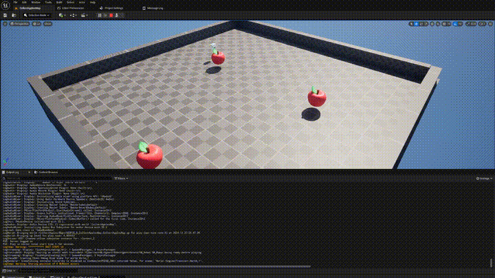
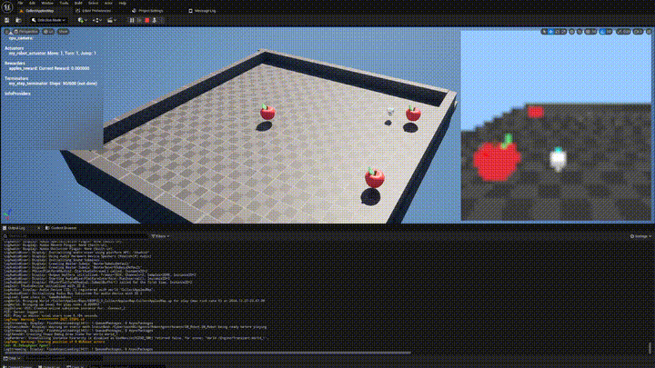
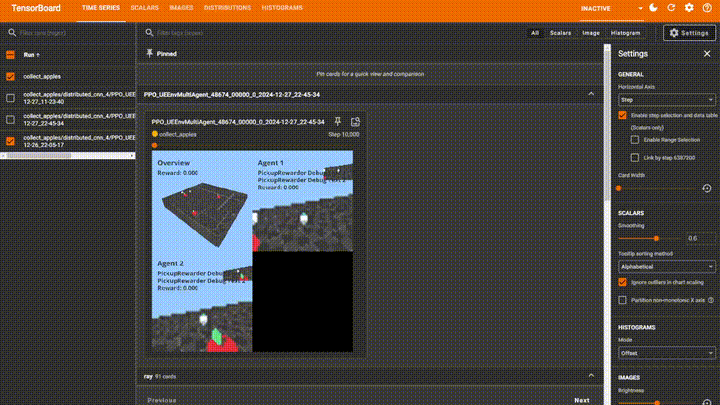

# UERL
## Reinforcement Learning with UE5, distributed on Ray using RLLib or Stable-Baselines3
### Optimised for large-scale experiments




## Highlight features
- CPU Rendering
- Scalability on Ray cluster
- Algorithm agnostic (Tested with RLLib and StableBaselines3)
- Easy to debug and try in UE5 Editor


## Quickstart (Docker)

1) Build Docker Image containing Python training backend.
```
sudo docker build -t uerl_demo .
```
2) Run Docker container
```
sudo docker run -it uerl_demo
```
3) Open UE project RLExamples (You should see CollectApplesMap)
4) Execute `ML.bForceHardLockStep 0` (This prevents editor world from freezing up.  
With hard step enabled the whole engine waits for external `Gym::Step` and only Websocket is being ticked)
5) Click Play In Editor (Editor should still tick but PIE world should be frozen)
6) Run `epic_demo/apples_editor_simple_validation.py --ip [EDITOR_MACHINE_IP]` (This will run pre-trained model)
7) Stop the PIE and kill the Python script (in this order)
8) Run `epic_demo/collect_apples_editor_render_cpu.py --ip [EDITOR_MACHINE_IP]` (This will start training new model from scratch) 
9) Try other examples in `epic_demo` 

<strong>To enable GPU support install [NVIDIA Container Toolkit](https://docs.nvidia.com/datacenter/cloud-native/container-toolkit/latest/install-guide.html) </strong>

## Quickstart (Conda Install)
### Requirements 
- Workstation with UE5.5 editor
- Linux VM or Workstation (Preferably with at least 1 GPU; Tested on Ubuntu 22.04 Server)

<i>Both editor and Linux VM should be on the same network</i>

### Run Training in Editor environment
1) Run the `setup.sh` script which
    - Installs conda (if not present)
    - Creates new env (uerl)
    - pip installs requirements
    - pip installs the project itself
    - creates folder structure

2) Open UE project RLExamples (You should see CollectApplesMap)
3) Execute `ML.bForceHardLockStep 0` (This prevents editor world from freezing up.  
With hard step enabled the whole engine waits for external `Gym::Step` and only Websocket is being ticked)
4) Click Play In Editor (Editor should still tick but PIE world should be frozen)
5) Run `epic_demo/collect_apples_editor_render_cpu.py`
6) Eject from current character and fly to see the agent running around randomly 




7) To see exactly what is happening (what agent sees, what are the actuator/sensor/terminator states etc)  
Execute `ML.DebugAgent Agent1`



8) Exit from PIE

### Play as agent

1) Execute console command `ML.bHumanMode 1` 
2) Press play
3) Start a Human-Run (where we play as the agent would, including display showing sensor data) by pasting an example run config to console  
Get this command from any `UEEnvConfig` by executing `ue_conf.get_ue_human_mode_command()`. See `collect_apples_editor_render_cpu.py` for an example.
```
ML.HumanStart {"launch_settings": {"map_name": "CollectApplesMap", "no_sound": true, "run_name": "run_name_not_set", "tickfps": 20, "specific_ip_port": ["", -1], "window_res_x": 320, "window_res_y": 240, "executable_path": "", "output_ue_log": false}, "agent_configs": [{"agent_id": "Agent1", "agent_ue_class": "/CybertoothML/Agents/RobotAgent/BP_RobotAgent.BP_RobotAgent_C", "spawn_point_name": "Agent1", "sensor_configs": [{"name": "camera_cpu", "ue_class_name": "camera", "attach_to_comp_name": "CameraComp", "attach_to_actor_name": "", "width": 42, "height": 42, "max_distance": 15000.0, "fov": 70, "use_gpu": false, "grayscale": false, "render_owner": true, "srgb": false, "frame_stack_size": 1, "normalise": false}], "actuator_configs": [{"name": "my_robot_actuator", "ue_class_name": "robot_movement"}], "rewarder_configs": [{"name": "apples_reward", "ue_class_name": "pickup_reward"}], "terminator_configs": [{"name": "my_step_terminator", "ue_class_name": "step_counter", "max_step_count": 350}], "infos_configs": []}], "episode_renderer_config": null}
```
<strong>Why is the game so fast?</strong>
By default, the delta between steps/frames is fixed. This allows us to run the environment with above-real-time speed. 


## Run with multiple nodes
### Kubernetes [recommended for prod]
- Create a Kubernetes cluster of your choice
- Install KubeRay Operator
- Install local image registry (we will need it to distribute custom worker/head images across the cluster)
- Install minio storage (you can choose any other storage alternative supported by [Ray Persistent Storage](https://docs.ray.io/en/latest/train/user-guides/persistent-storage.html))

#### Minio Server
Example deployment YAML file is provided at `kubernetes/minio-server.yaml`  
The file creates a public (for both read and write) `rayexperiments` bucket.  
Each ray run will be logged to a subfolder in the `rayexperiments` bucket.  
Please change the default username/password asap.

#### Image Registry
In production, we want to add as many packages and dependencies to the worker images as possible, to speed up init proccess.  
We could push it to private registry on DockerHub or AWS, but keeping it on local network is always faster.  
Example deployment YAML file is provided at `kubernetes/private-registry.yaml`  
Example Dockerfiles for CPU and GPU workers are provided also in `kubernetes/` folder.

### Ray cluster
For testing and prototyping connecting multiple machines is the most straight forward approach.  
You need to setup each node in the cluster by running `setup.sh` and setting up shared storage.  
There are plenty of options, such as creating an `Windows Share (SMB)` and mounting it on each node.  
More scalable solution would be to use `minio (s3)`, which is slightly buggy on latest Ray version.  
There is plenty of other options described here - [Ray Persistent Storage](https://docs.ray.io/en/latest/train/user-guides/persistent-storage.html)

After you setup each node, run 
```
# On Head Node
ray start --head --port=6379 --resources='{"rollout_space": 25}' --num-gpus 2
# On Any other CPU node
ray start --address='<HEAD-NODE-IP>:6379' --resources='{"rollout_space": 64}' --num-cpus=64 --memory=100000000000 --num-gpus 0
```

Adjust the commands above to fit your hardware.  
The system is designed so `rollout_space` is limiting to keep space for learner on GPU nodes.  
Without using custom `rollout_space`, all workers that might not need GPU would take all CPU/Memory   
resources on GPU node, resulting in learner being scheduled on CPU node. 

If you want to have a dedicated node for learner (useful for off-policy training), set `rollout_space` to `0` on that node.  
Otherwise, if you want to maximise number of workers, set `rollout_space` on GPU node about 4 CPU cores less than max cores available.  


## CPU Rendering
CPU rendering is expensive, but significantly reduces cloud training costs since we don't need GPU instances.  
In UE5.2 and above, in <strong>non-editor builds</strong>, to enable CPU rendering edit of source code is required.  
Comment out the check that prevents setting render data to static mesh if app is not rendering in `StaticMesh.cpp:6395`.
```cpp
// if (FApp::CanEverRender() || !FPlatformProperties::RequiresCookedData())	// cooked assets can be loaded also in the headless editor commandlets
// {
    SetRenderData(MoveTemp(LocalRenderData));
// }
```


## Communication Layer
We tried both raw `websockets` and `gRPC`. The overhead from using websockets over `gRPC` was negligable,  
and websockets gave us more flexibility, thus the current implementation is using websockets. But updating to `gRPC`
shouln't be too difficult.

## Render Episodes
It is very useful to see how the agent is progressing over time when the training is running on a large cluster without GPU rendering.  
Using CPU or GPU rendering via `EpisodeRendererConfig` we can render an episode from multiple cameras and stitch the view to a single video. So for example we can render view from high-angle to capture whole map and from each agent.  
These videos are automatically associated with step count and sent to Tensorboard, where we can browse along the time axis to see the agent progressing over time.  



### Episode itself (Early in the training)
